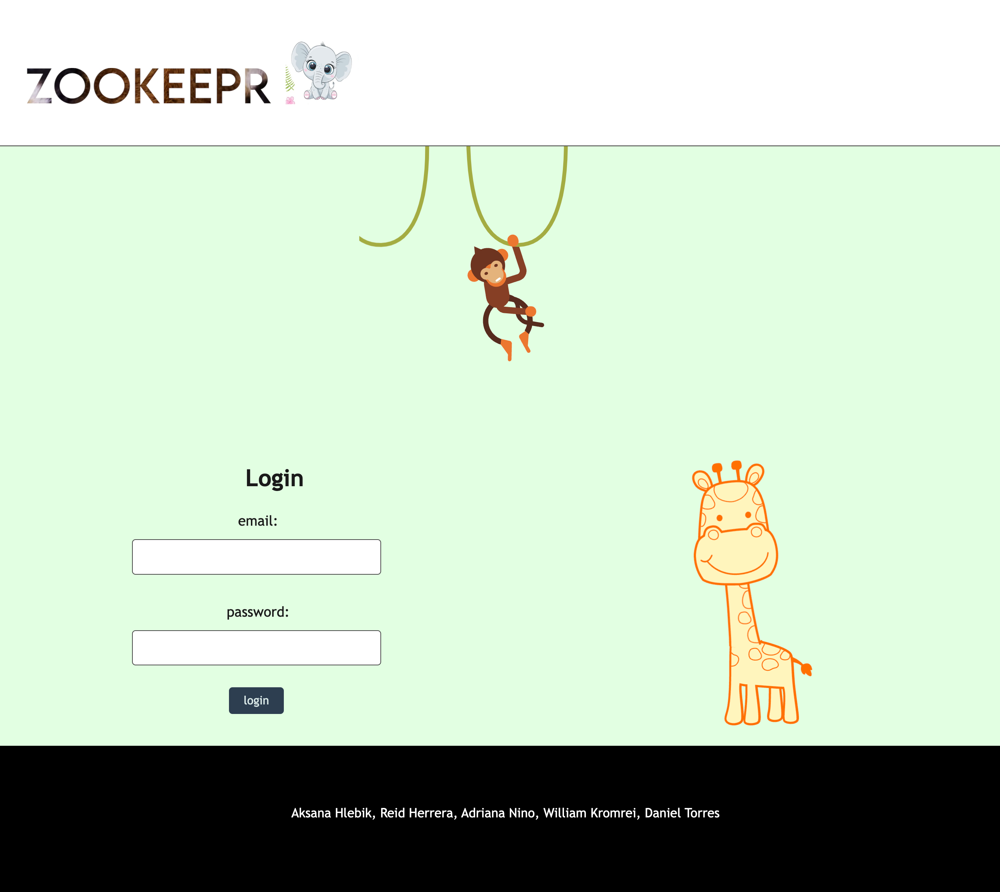
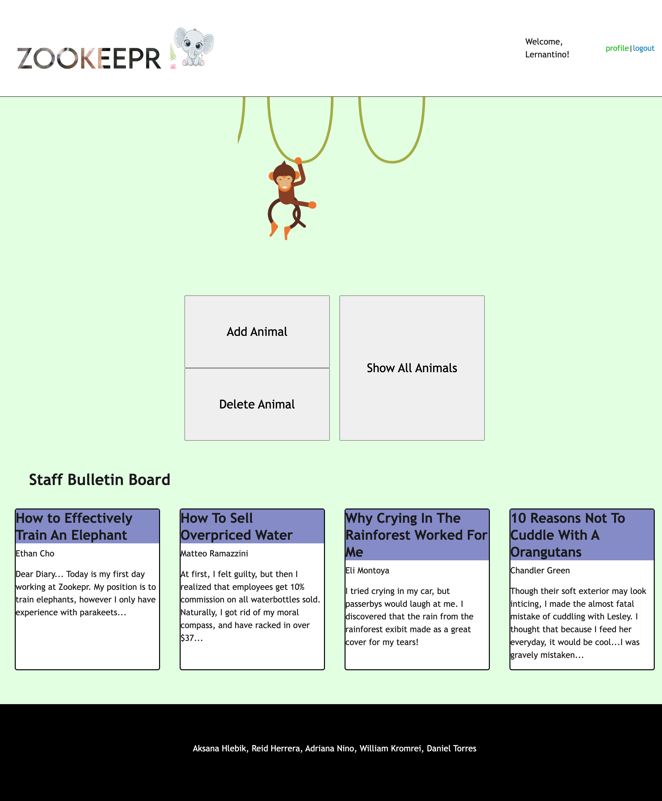
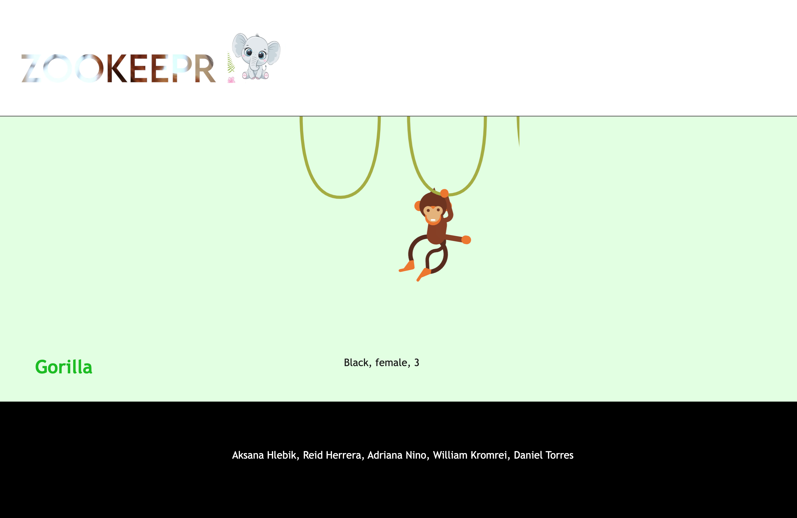

# Zookeepr
This web-site is a Zookeepr administrators.

## Description
This web-site was created for people who's  working with animals.

## Usage
1. Open:  https://zookeepr-mxgb.onrender.com
2. Fill out the fields email and password and press 'login' button.
3. After loginning,you will redirected to the profile page.
4. Profile page contains information about animals and "Add" and "Delete" buttons.

## Technologies Used
- Node.js
- Express.js
- Handlebars.js
- Sequelize 
- PostgreSQL
- Passport.js
- CSS
- JavaScript

## Contribution guidelines
To make some changes create a feature branch. This is the branch where you will be adding a new code.
In the feature branch make commits of all the changes in your code while working.
Push up the changes to feature branch in GitHub repo.
Open pull request.
Wait untill pull request is approved.

## Test instructions
N/A
The following images show the wed-site appearance and functionality:

